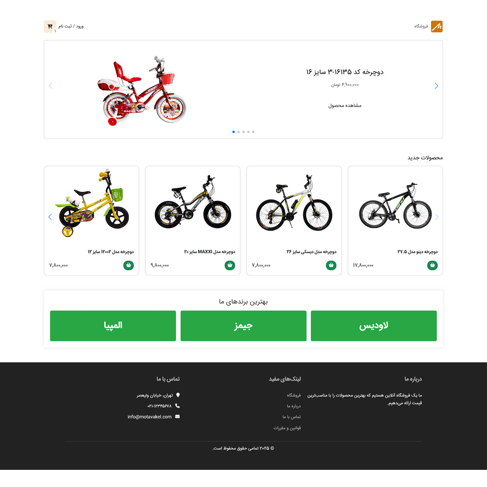
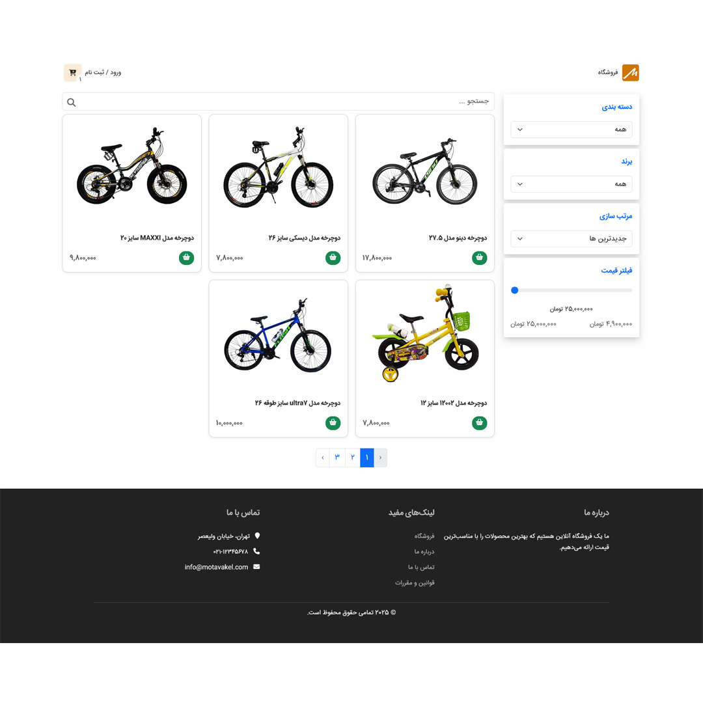
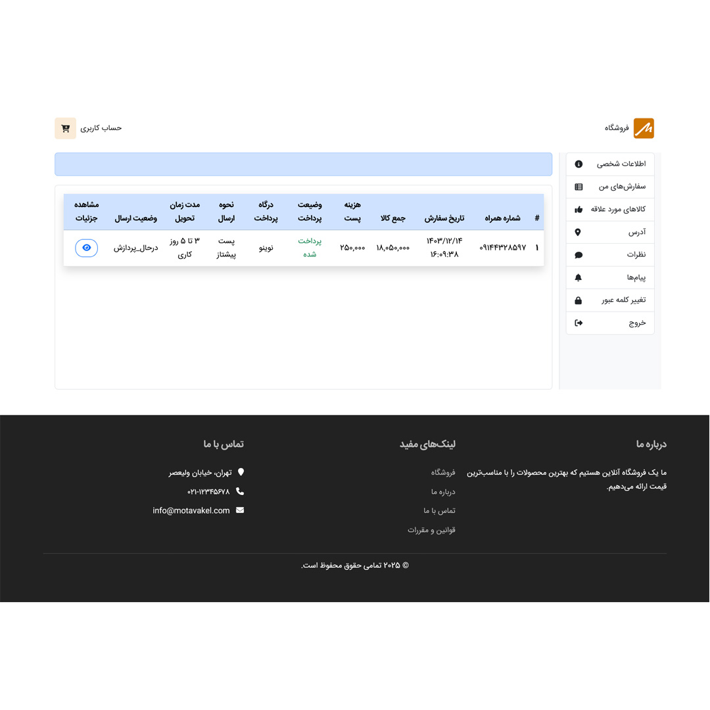
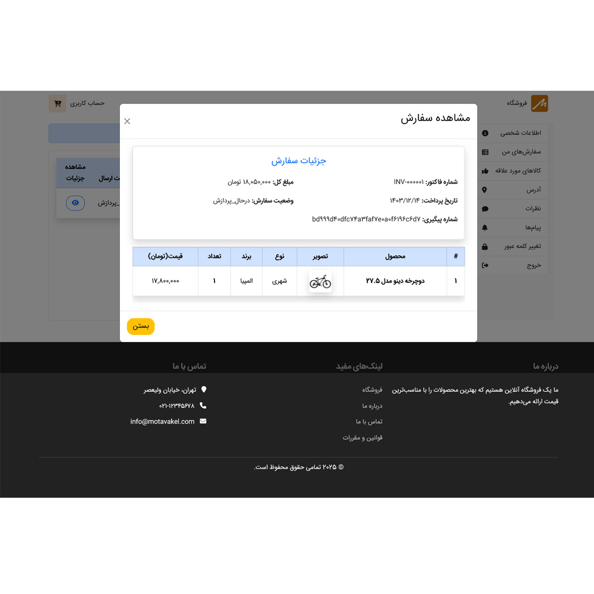
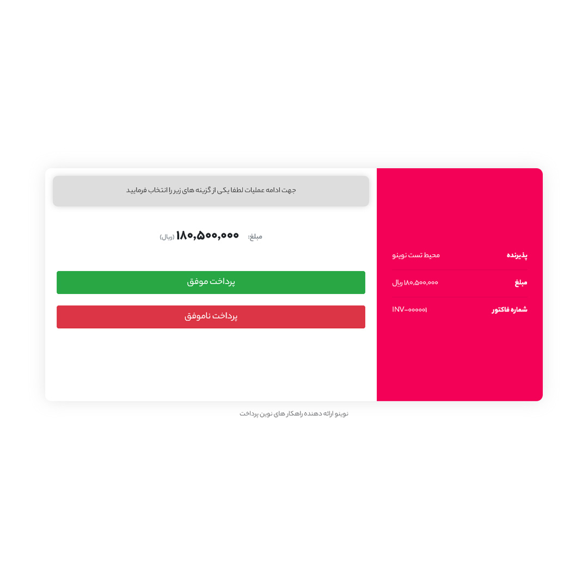
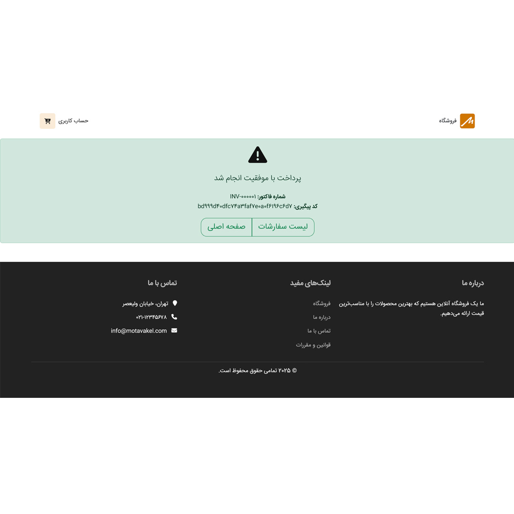

## فروشگاه اینترنتی - بک‌اند دات‌نت و فرانت‌اند انگولار
  
## گالری تصاویر

  
  
  

  
  
  

### معرفی

این پروژه یک فروشگاه اینترنتی با استفاده از **ASP.NET Core** برای بک‌اند و **Angular** برای فرانت‌اند است. بک‌اند بر اساس **معماری تمیز** پیاده‌سازی شده و چندین الگوی طراحی و بهترین شیوه‌ها برای مقیاس‌پذیری و نگهداری آسان در آن استفاده شده است.
 
 

### بک‌اند (ASP.NET Core)

### ویژگی‌های اصلی
- **معماری تمیز**: سازماندهی لایه‌ها برای تفکیک مسئولیت‌ها و خوانایی بیشتر.
- **الگوی Unit of work/Generic Repsitory**: پیاده‌سازی مدیریت تراکنش‌ها و جلوگیری از نوشتن کد تکراری برای هر موجودیت
- **الگوی Specification**: استفاده از الگو S. برای پیاده سازی شرط های لینک در جنریک ریپوزیتوری
- **CQRS با MediatR**: پیاده‌سازی الگوی Command Query Responsibility Segregation (CQRS) با استفاده از پکیج MediatR برای جدا کردن عملیات خواندن و نوشتن.
- **دیتابیس Redis**: استفاده از Redis در Docker برای ذخیره‌سازی داده‌های کوتاه‌مدت (e.g ذخیره‌سازی سبد خرید).
- **FluentValidation**: پیاده‌سازی اعتبارسنجی با استفاده از پکیج FluentValidation برای اعتبارسنجی ورودی‌ها.
- **توکن‌های JWT برای احراز هویت**: استفاده از توکن‌های JWT برای احراز هویت امن کاربر.
- **AutoMapper**: خودکارسازی و ساده سازی تبدیل مدل ها.
- **پایپ لاین های مدیاتور**: استفاده از پایپ لاین های متنوع مدیاتور برای اندازه گیری مدت زمان پاسخ به درخواست، اعتبارسنجی ورودی و اعمال کشینگ به درخواست های پر تکرار ( e.g درخواست فیلتر محصولات در صفحه آرشیو محصولات) 
- **Identity**: پیاده‌سازی احراز هویت و ثبت‌نام کاربران با استفاده از ASP.NET Identity.
- **تست نویسی با یونیت تست**: استفاده از XUNIT TEST برای تست واحد

 
 

## فرانت‌اند (Angular)

- **در حال توسعه**: فرانت‌اند در حال توسعه است و ویژگی‌های اصلی در حال پیاده‌سازی است.

## راه‌اندازی پروژه

- **Docker**: برای اجرای Redis در کانتینر.
- **.NET SDK**: برای ساخت و اجرای بک‌اند.
- **Node.js و Angular CLI**: برای ساخت و اجرای فرانت‌اند.

### راه‌اندازی بک‌اند با ویژوال استودیو
1. مخزن را کلون کنید.
2. با توجه به تعریف داکر فایل و داکر کمپوسر و انجام تنظیات موردنیاز صرفا **Configuration Dropdown** در حالت **docker-composer** قرار دهید.

### راه‌اندازی فرانت‌اند
1. مخزن را کلون کنید.
2. با استفاده از دستور `npm install` وابستگی‌ها را نصب کنید.
3. از دستور `ng serve` برای راه‌اندازی فرانت‌اند استفاده کنید.

